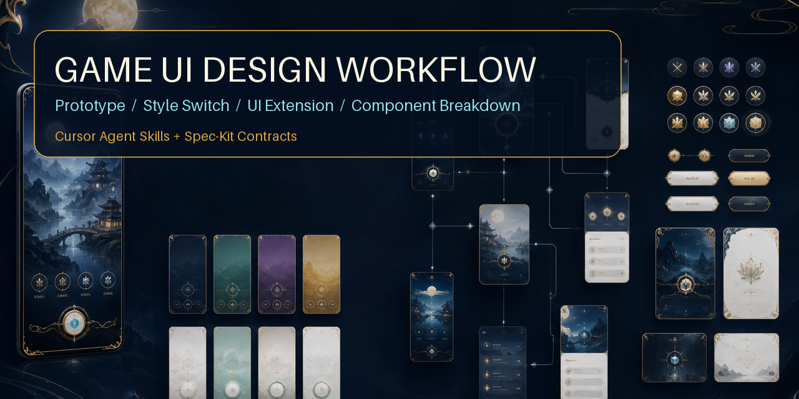

# Game UI Design Workflow

[](https://github.com/guiguiyan930-source/game-ui-design-workflow/actions/workflows/validate.yml)
[](https://github.com/guiguiyan930-source/game-ui-design-workflow/releases)
[](LICENSE)



一个面向 Cursor Agent 的游戏 UI 设计技能仓库。它用 Spec-Kit 风格的项目文档串联能力：

1. **策划与需求（生成第一步）**：游戏策划方案（GDD）、PRD、UI 交互逻辑 → `game-ui-product-design`
2. UI 规范：建立视觉语言、设计令牌、布局和交互规则。
3. UI 延展：从玩法与玩家旅程扩展完整屏幕地图。
4. 页面生成：逐页生成方案、提示词与视觉稿。
5. 组件拆解：把已批准页面拆成可复用、可交付的独立素材。
6. 雪碧图拆分：去掉元素文字，将组件合图切成单元素透明 PNG，并打包 ZIP。
7. 资产交付：语义命名、9-slice、Atlas 与 Godot / Unity / Cocos JSON。

`game-ui-workflow` 是总控技能；阶段技能也可独立调用。项目事实保存在 `specs/<project>/`，避免只依赖对话上下文。

## 使用场景

- 只有游戏概念，需要先写策划方案、PRD 和 UI 交互逻辑再生图。
- 只有游戏概念或参考图，需要先生成一张可讨论的 UI 原型视觉。
- 已有页面结构，需要切换国风、科幻、卡通等视觉方向并保留版本对比。
- 已有首页，需要延展编队、关卡、战斗、商城、活动等完整页面系统。
- 页面已批准，需要拆成透明背景按钮、图标、卡片、角色和装饰素材。
- 已生成组件雪碧图，需要自动切成单元素 PNG 并提供 ZIP 下载包。
- 已有语义 PNG，需要生成 9-slice、Atlas 和引擎交付清单。
- 团队需要把 UI 决策沉淀为可复用契约，避免连续页面风格漂移。
- 设计成果需要交付开发，希望页面、组件、状态、尺寸和资源来源可追踪。

不适合直接用来替代游戏客户端实现、服务端接口设计或未经确认的大批量最终生图。

## 30 秒使用方法

安装到当前项目：

```bash
./install.sh --project /path/to/your-game
```

初始化 UI 工作区：

```bash
python3 scripts/init_project.py your-game-id
```

在 Cursor 中调用：

```text
使用 game-ui-workflow，读取 @specs/your-game-id 和我的参考图。
依次执行第 1 步策划与 PRD（game-ui-product-design），再执行原型生成视觉、UI 风格切换、UI 延展、UI 组件拆解、雪碧图拆分打包和 Atlas 引擎交付。
每一步完成后停止，列出检查项，并给出可直接复制的下一步调用文本。
```

详细方法见 [中文调用指南](docs/SKILL_USAGE.zh-CN.md)。

## 工作流（第 1 步起）

```text
第 1 步  策划方案 + PRD + UI 交互逻辑（批准）
第 2 步  原型生成视觉
第 3 步  UI 风格切换与批准
第 4 步  UI 页面延展与逐页生成
第 5 步  UI 组件拆解与雪碧图生成
第 6 步  雪碧图拆分、单元素 PNG 与 ZIP 打包
第 7 步  语义命名、9-slice、Atlas 与引擎 JSON
```

每一步都会说明输入、输出、检查项、人工门禁和可直接复制的下一步调用文本。**第 1 步未批准时不会进入原型生图**；页面未批准时不会提前拆解组件。

## 特性

- 8 个可自动触发或显式调用的 Cursor Agent Skills
- 需求、研究、计划、任务、契约和复现文档持久化
- 页面和组件提示词、图片、状态、版本及来源可追踪
- PNG 真实尺寸、透明通道和 SVG 尺寸校验
- 自动化测试与 GitHub Actions 持续验证
- 图片工具不可用时安全降级为 `pending-generation`

## 目录

```text
skills/
  game-ui-workflow/
  game-ui-product-design/
  game-ui-specification/
  game-ui-extension/
  game-ui-page-generator/
  game-ui-component-breakdown/
  game-ui-sprite-sheet-splitter/
  game-ui-asset-pipeline/
templates/
  spec-kit/
  contracts/
scripts/
  init_project.py
  validate_project.py
  validate_skills.py
  split_sprite_sheet.py
  build_sprite_atlas.py
  export_engine_manifest.py
schemas/
config/
tests/
install.sh
specs/
examples/
```

## 安装

使用一键安装脚本安装到指定项目：

```bash
./install.sh --project /path/to/your-game
```

安装为个人技能：

```bash
./install.sh --personal
```

默认不会覆盖同名技能；确认升级时增加 `--force`。不要安装到 Cursor 内置的 `~/.cursor/skills-cursor/`。

完整的安装、显式调用、分阶段确认、页面批准和组件拆解示例见
[游戏 UI 技能调用指南](docs/SKILL_USAGE.zh-CN.md)。

完整交付示例见 [月宫列传：从首页原型到组件拆解](examples/moon-palace-rpg/README.md)。

Factory v2 资产生产示例见 [欧美卡通生存商店：Token、语义切图、Atlas 与引擎 JSON](examples/factory-v2-shop/README.md)。

更多分阶段示例见 [示例索引](examples/README.md)：

- [UI 风格切换](examples/style-switch/README.md)
- [UI 页面延展](examples/screen-extension/README.md)
- [UI 组件包拆解](examples/component-pack/README.md)
- [雪碧图拆分与 PNG 打包](examples/sprite-sheet-splitting/README.md)
- [Game UI Factory v2 商店案例](examples/factory-v2-shop/README.md)

视觉对比和完整操作链路见 [效果演示](docs/DEMO.zh-CN.md)。

## 快速开始

```bash
python3 scripts/init_project.py moon-palace-rpg
python3 scripts/validate_project.py specs/moon-palace-rpg
```

然后在 Cursor 中提出：

```text
使用 game-ui-workflow，根据参考图为一款国风卡牌 RPG 建立完整 UI 项目，
先完成规范和屏幕地图，再生成首页视觉，批准后拆解首页组件。
```

端到端流程：

```text
spec.md
  → research.md
  → contracts/style-contract.yaml
  → plan.md + contracts/screen-contract.yaml
  → assets/pages/ + asset-manifest.yaml
  → contracts/component-contract.yaml + assets/components/
  → tasks.md + quickstart.md + validation
```

## 阶段调用

- “建立这个游戏的 UI 规范” → `game-ui-specification`
- “基于现有首页延展完整页面” → `game-ui-extension`
- “生成商城页视觉并保存图片” → `game-ui-page-generator`
- “把这个页面拆成透明背景组件” → `game-ui-component-breakdown`
- “把组件雪碧图切成单个 PNG 并打包” → `game-ui-sprite-sheet-splitter`
- “生成 9-slice、Atlas 和引擎 JSON” → `game-ui-asset-pipeline`
- “从需求一直做到组件交付” → `game-ui-workflow`

图片生成工具可用时，技能应实际生成并保存图片；不可用时保留完整提示词，将资源状态标为 `pending-generation`，不能伪造文件。

## 项目约束

- `spec.md` 是需求与验收标准的唯一来源。
- `contracts/` 是跨阶段视觉一致性的唯一来源；后续阶段不得静默改写。
- 页面生成一次只处理一个页面，批准后才进入组件拆解。
- 所有资源必须登记到 `contracts/asset-manifest.yaml`。
- 修改项目后运行校验脚本；失败项修复前不得宣称交付完成。

## 质量检查

```bash
python3 -m unittest discover -s tests -v
python3 scripts/validate_skills.py
python3 scripts/validate_project.py examples/moon-palace-rpg --strict
python3 scripts/validate_project.py examples/factory-v2-shop --strict
```

GitHub Actions 会在 push 和 pull request 时自动运行这些检查。

## 参与贡献与版本

- 贡献方式：[CONTRIBUTING.md](CONTRIBUTING.md)
- 版本记录：[CHANGELOG.md](CHANGELOG.md)
- 发布与安装：[docs/RELEASE.md](docs/RELEASE.md)
- 兼容性说明：[docs/COMPATIBILITY.md](docs/COMPATIBILITY.md)
- Factory v2 架构：[docs/GAME_UI_FACTORY_V2.zh-CN.md](docs/GAME_UI_FACTORY_V2.zh-CN.md)
- 路线图与未实现能力：[docs/ROADMAP.md](docs/ROADMAP.md)
- 隐私与版权：[docs/SECURITY.md](docs/SECURITY.md)
- 契约迁移：[docs/MIGRATION.md](docs/MIGRATION.md)
- 问题与建议：[GitHub Issues](https://github.com/guiguiyan930-source/game-ui-design-workflow/issues)

## 项目来源与演进

本仓库由作者此前创建并维护的四个游戏 UI 技能整合演进而来：

- [Game-UI-Extension](https://github.com/guiguiyan930-source/Game-UI-Extension)
- [game-ui-page-generator](https://github.com/guiguiyan930-source/game-ui-page-generator)
- [game-ui-specification](https://github.com/guiguiyan930-source/game-ui-specification)
- [game-ui-component-breakdown](https://github.com/guiguiyan930-source/game-ui-component-breakdown)

这些仓库属于同一作者的早期实践，并非本项目引入的第三方技能。整合原因、能力映射和新增内容见 [ORIGIN.md](ORIGIN.md)。
