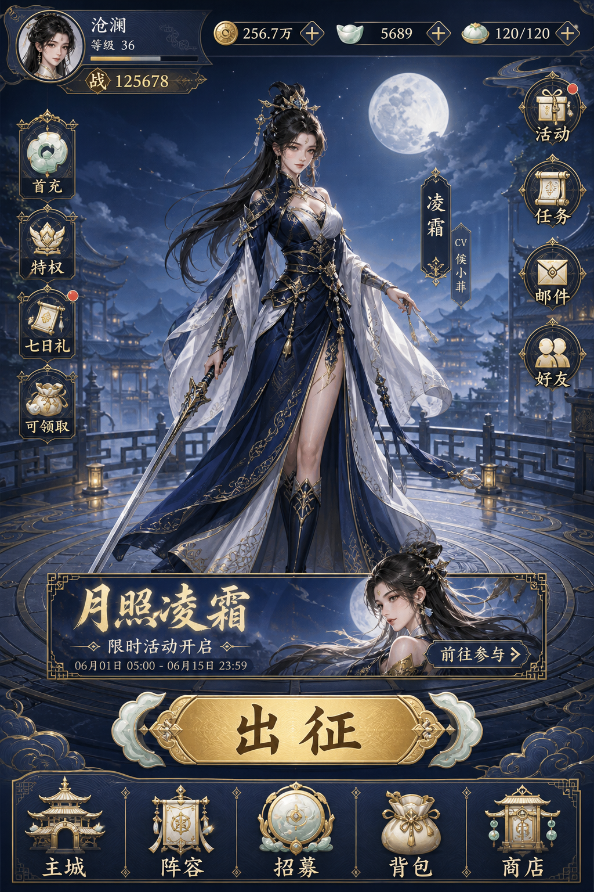
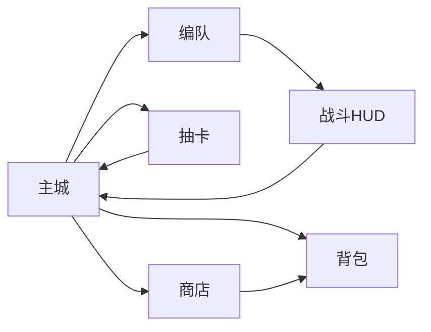
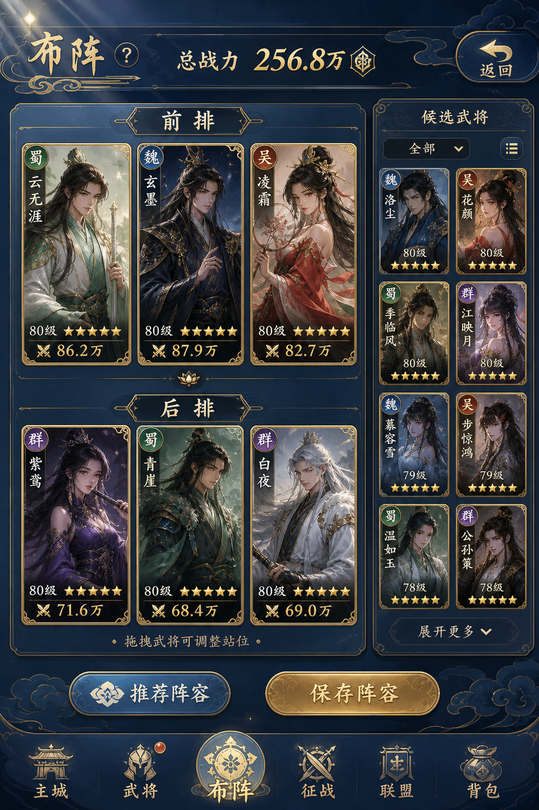
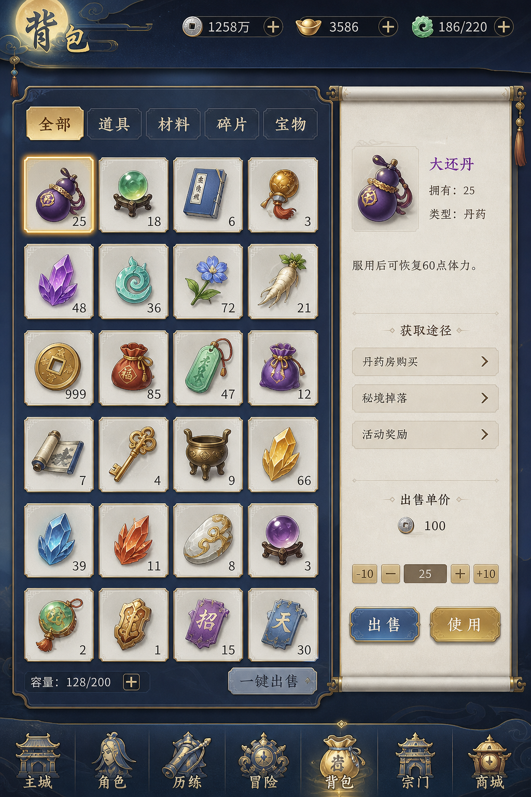
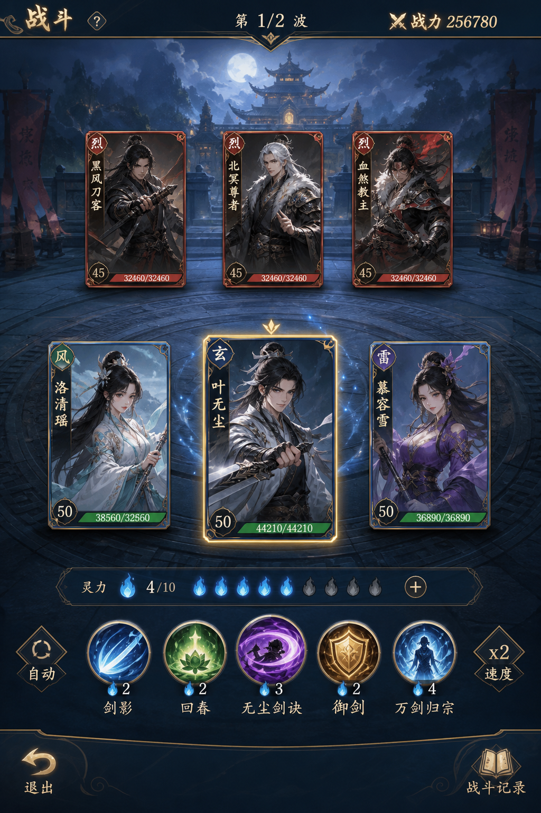
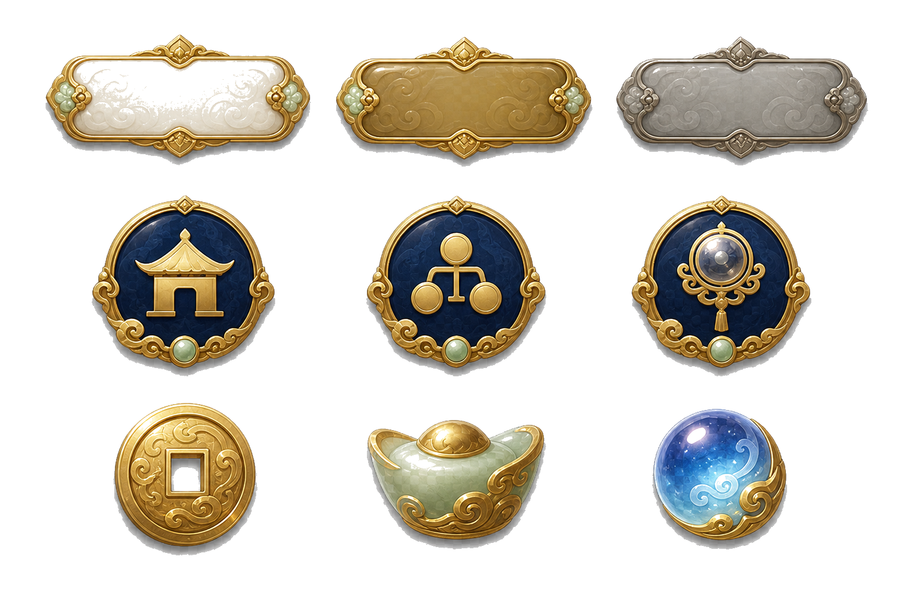
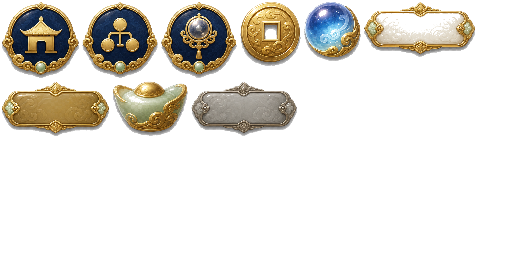

# 效果演示

本页用**云阙列传（国风卡牌 RPG）**展示从生成第 1 步到 Atlas 引擎交付的完整效果。早期月宫列传示例仍保留在 [`examples/moon-palace-rpg`](../examples/moon-palace-rpg/README.md)。

## 1. 生成第 1 步：策划 / PRD / 交互

正式生图前先批准：

- [游戏策划方案](../examples/guofeng-card-rpg/gdd.md)
- [产品需求](../examples/guofeng-card-rpg/prd.md)
- [UI 交互逻辑](../examples/guofeng-card-rpg/interaction.md)

## 2. 原型生成视觉

输入：

- 国风卡牌 RPG（云阙列传）
- 手机竖屏 9:16
- 深蓝、鎏金、白玉
- 主城承担资源识别与去向导航

输出基准页：



该阶段验证信息架构：顶部资源、中部角色舞台、主 CTA、底部五入口导航。

## 3. UI 风格与页面延展

风格契约冻结为深蓝鎏金后，按核心循环延展：



已批准延展页示例：

| 编队 | 背包 | 战斗 |
|---|---|---|
|  |  |  |

## 4. 雪碧图拆分与 PNG 打包



自动拆分后得到语义透明 PNG 与：

- [home-ui-png.zip](../examples/guofeng-card-rpg/packages/home-ui-png.zip)

## 5. Atlas 与引擎交付

本主案例已包含：

- Atlas PNG + JSON
- Godot / Unity / Cocos JSON handoff



欧美卡通商店专项另见 [Factory v2 商店案例](../examples/factory-v2-shop/README.md)。

## 6. 可复制调用

```text
使用 game-ui-workflow，参考 @examples/guofeng-card-rpg。
从第 1 步策划与 PRD 开始，再执行原型视觉、延展、
组件拆解、雪碧图打包与 Atlas 引擎交付。
每一步完成后停止，列出检查项和下一步调用文本。
```

校验：

```bash
python3 scripts/validate_project.py examples/guofeng-card-rpg --strict
```
