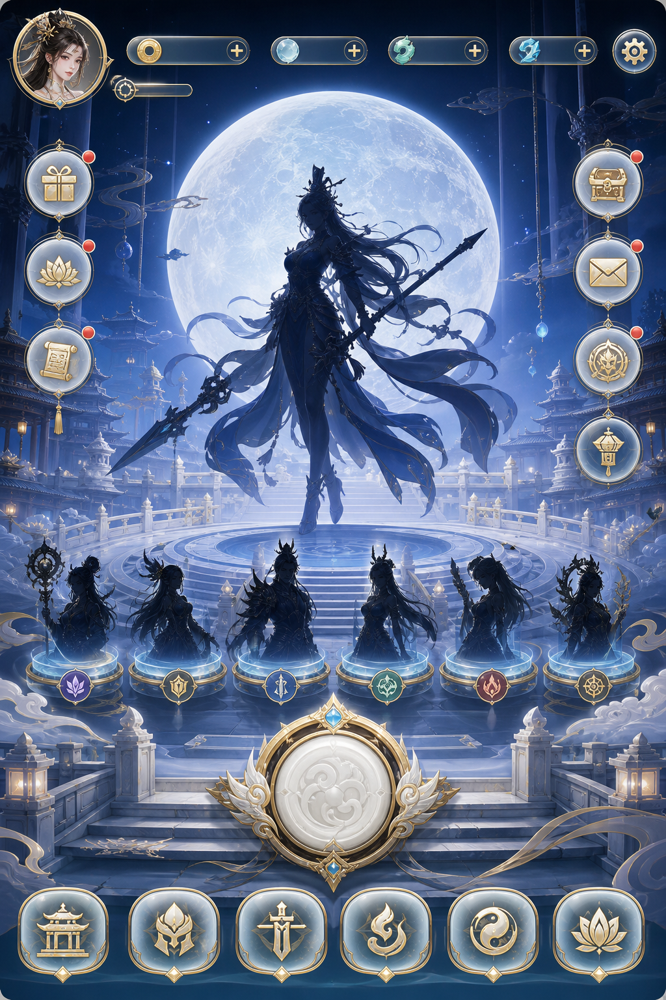
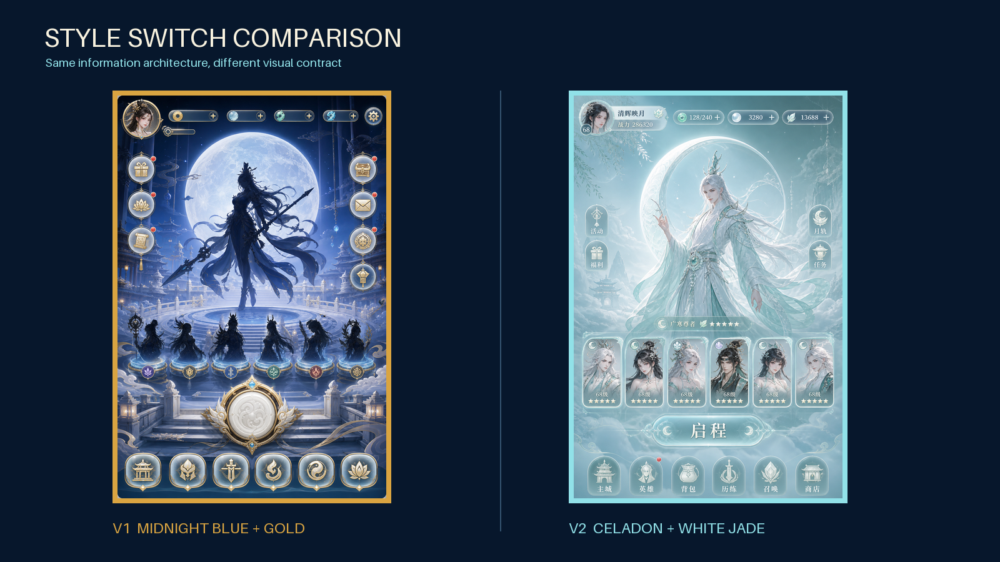
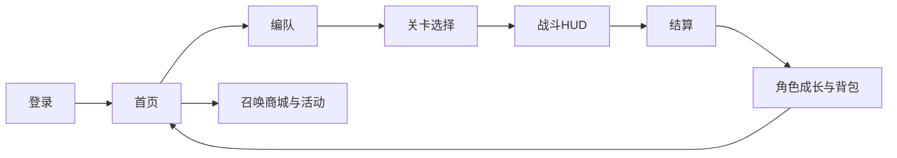
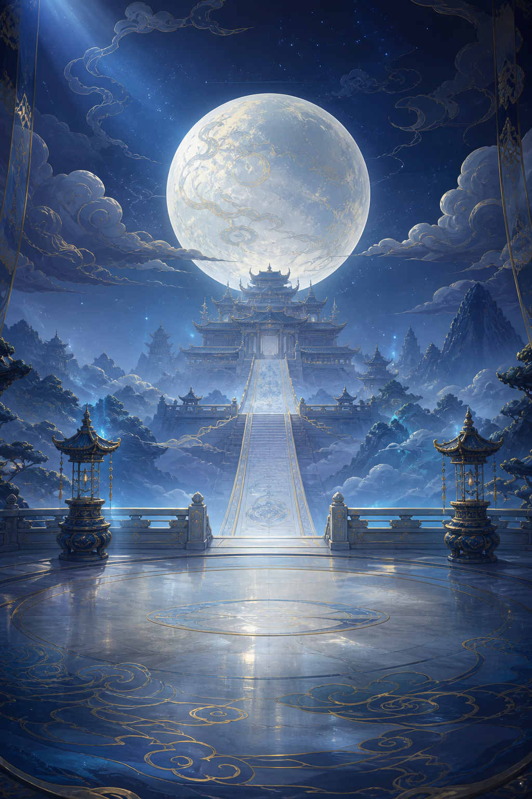

# 效果演示

本页用“月宫列传”展示原型视觉、风格切换、页面延展和组件拆解的完整效果。

## 1. 原型生成视觉

输入：

- 国风神话卡牌 RPG
- 手机竖屏
- 月宫、深蓝、鎏金、白玉
- 首页承担继续主线和每日回流

输出基准页：



该阶段首先验证信息架构：顶部资源、中部主视觉、六人阵容、主 CTA、受控侧边入口和底部导航。

## 2. UI 风格切换

保持信息架构不变，把视觉契约从“深蓝鎏金”切换为“青白玉石”：



变化内容：

- 午夜蓝与暖金 → 青白玉、月银与低饱和湖蓝
- 拉丝金属 → 半透明玉和磨砂玻璃
- 厚重外框 → 轻量银边与柔和冷光
- 高对比神秘感 → 轻盈、清冷和通透

保持不变：

- 顶部玩家与资源区域
- 中央角色和月轮焦点
- 六人阵容
- 主操作位置
- 六项底部导航

切换时应生成新版本，不覆盖旧稿。用户选择方案后，才把对应 `style-contract.yaml` 和基准页面标记为批准。

## 3. UI 页面延展

从批准首页扩展首发玩家旅程：



延展分两步：

1. 先用 `game-ui-extension` 生成屏幕地图、依赖、状态和边界场景。
2. 范围确认后，用 `game-ui-page-generator` 一次生成一个页面。

页面未批准时生成 `v2`，不覆盖 `v1`；批准后再进入下一页。

## 4. UI 组件拆解

已批准首页可拆为：

- 场景背景
- 主按钮的默认、按下和禁用状态
- 底部导航及选中态
- 金币、月玉和体力图标
- 卡片边框、红点、月牙光效
- 角色和阵容底座

背景示例：



透明矢量按钮示例：

[查看主按钮 SVG](../examples/moon-palace-rpg/assets/components/primary-button-default-v1.svg)

组件拆解要求：

- 除背景外默认透明
- 默认不要文字
- 每个组件和状态独立文件
- 真实尺寸和透明通道与 manifest 一致
- 页面专属组件和跨页面复用组件分开管理

## 5. 可复制调用

```text
使用 game-ui-workflow，读取 @specs/your-game-id 和参考图片。

按以下顺序执行：
1. 为首页生成一张未批准的原型视觉；
2. 保持结构不变生成一个风格切换版本，等待我选择；
3. 风格批准后先建立屏幕地图，再逐页延展；
4. 只从已批准页面拆解独立透明组件；
5. 最后运行严格校验。

每一步结束时停止，列出产物、检查项、进入下一步的条件，
并提供可直接复制的下一步调用文本。
```

更完整的操作说明见 [技能调用指南](SKILL_USAGE.zh-CN.md)。
