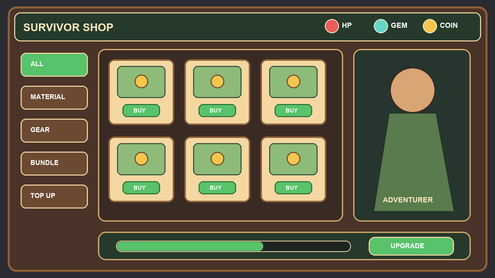
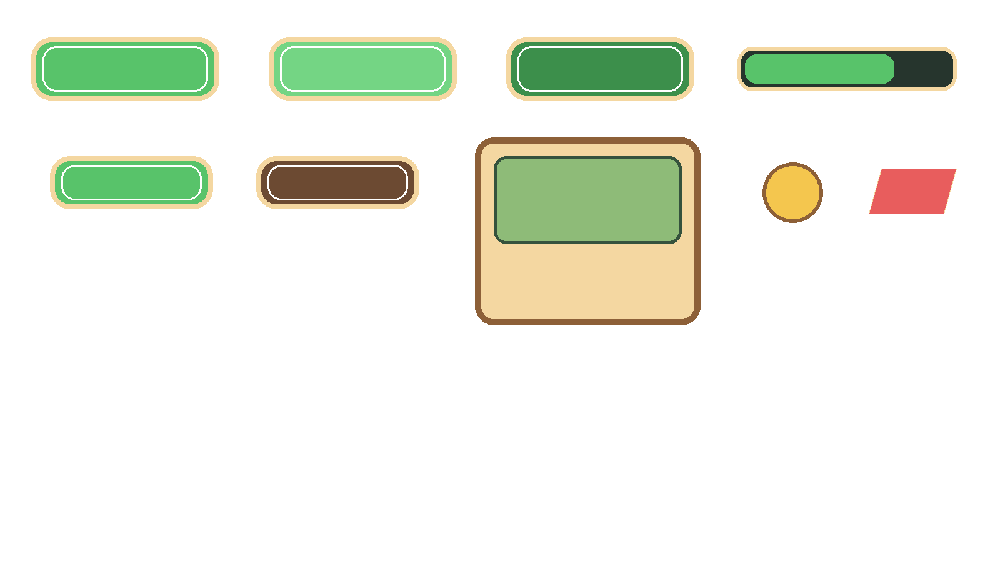

# Game UI Factory v2：欧美卡通生存商店

本案例来自一个公开 ChatGPT 分享对话：用户要求使用本仓库设计游戏 UI，随后进入雪碧图拆分并优化工作流。

> 公开分享不包含用户上传的原始图片。仓库中的视觉稿根据对话公开文字重构，不冒充原图。

## 案例视觉



定位：

- 2D 欧美卡通生存 Roguelike
- 桌面端 16:9
- 绿色主操作、木质容器、羊皮纸商品卡
- 顶部资源栏、左侧分类、中央 3×2 商品、右侧角色、底部成长

## Factory v2 闭环

```text
设计 Token
→ 页面与组件契约
→ 无文字组件雪碧图
→ 语义 mapping
→ 独立透明 PNG + ZIP
→ 9-slice 元数据
→ Atlas PNG + JSON
→ Godot / Unity / Cocos JSON 清单
```

组件雪碧图：



Atlas：


## 语义切图

切图不是以 `element-001.png` 结束。案例使用
[`mappings/shop-components.yaml`](mappings/shop-components.yaml)
将检测顺序映射为稳定名称：

```text
shop-buy-button-normal.png
shop-buy-button-hover.png
shop-buy-button-pressed.png
shop-category-tab-active.png
shop-product-card-default.png
shop-currency-coin-default.png
```

执行：

```bash
python3 scripts/split_sprite_sheet.py \
  examples/factory-v2-shop/assets/sprites/shop-components-sheet.png \
  --output-dir examples/factory-v2-shop/assets/sprites/shop-components/items \
  --zip examples/factory-v2-shop/packages/shop-components-png.zip \
  --mapping examples/factory-v2-shop/mappings/shop-components.yaml \
  --min-area 100 --padding 5 --force
```

[下载 9 个独立透明 PNG 压缩包](packages/shop-components-png.zip)

## 9-slice 与 Atlas

按钮、标签和进度条由人工确认 9-slice margins；自动视觉推断仍是路线图能力。

```bash
python3 scripts/build_sprite_atlas.py examples/factory-v2-shop --force
```

命令会把 atlas contract 重置为 `packed`；检查图集后再改回 `approved`，不能沿用旧批准状态。

输出：

- [`assets/atlases/shop-ui.png`](assets/atlases/shop-ui.png)
- [`assets/atlases/shop-ui.json`](assets/atlases/shop-ui.json)
- [`contracts/atlas-contract.yaml`](contracts/atlas-contract.yaml)

内置打包器不旋转素材，保留透明通道、语义名称、状态、pivot 和 9-slice。

## 引擎交付

```bash
python3 scripts/export_engine_manifest.py examples/factory-v2-shop --force
```

命令会把 export contract 重置为 `generated`；检查三个 JSON 后再批准。

输出：

- [`exports/godot/shop-ui.json`](exports/godot/shop-ui.json)
- [`exports/unity/shop-ui.json`](exports/unity/shop-ui.json)
- [`exports/cocos/shop-ui.json`](exports/cocos/shop-ui.json)

这些是确定性 JSON 交付清单，不是原生 `.tres`、`.tscn`、Unity SpriteAtlas 或 Cocos 工程文件。

## 严格校验

```bash
python3 scripts/validate_project.py examples/factory-v2-shop --strict
```

校验覆盖：

- UI Token 结构
- 组件 ID、分类、状态与切图方式
- 9-slice margins 是否保留可拉伸中心
- 语义 PNG 尺寸与 Alpha
- ZIP 文件完整性
- Atlas JSON 和 regions
- 三种引擎 JSON 与导出契约

## 已实现与路线图

已实现：契约、语义 mapping、透明 PNG、ZIP、人工 9-slice、Atlas、引擎 JSON。

未实现：Grounding DINO / SAM2 自动识别、自动去字修复、自动九宫格推断、原生引擎插件和训练数据导出。详见 [`../../docs/ROADMAP.md`](../../docs/ROADMAP.md)。
