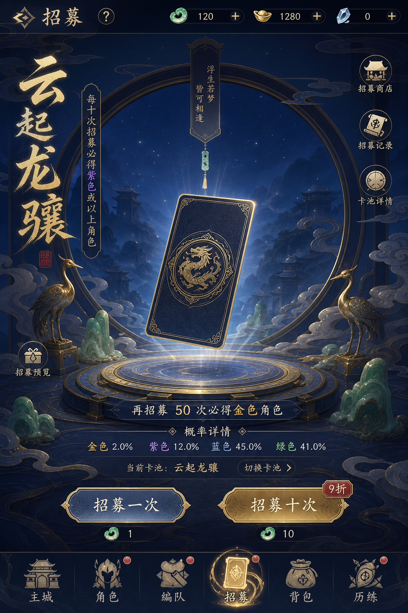

# 示例：云阙列传（国风卡牌 RPG）

`guofeng-card-rpg` 是本仓库的**主完整交付案例**，展示从生成第 1 步（策划 / PRD / 交互）到页面视觉、组件雪碧图、语义切图、Atlas 与三引擎 JSON 的闭环。

## 项目设定

- 游戏名称：云阙列传
- 游戏类型：国风卡牌 RPG
- 核心玩法：抽卡集卡、编队挑战、养成成长、商店补给
- 目标平台：手机竖屏 9:16（1080×1920）
- 视觉关键词：深蓝、鎏金、白玉、云纹、卷轴、窗棂
- 首个基准页面：主城 `home`

## 生成第 1 步：策划 / PRD / 交互

正式生图前已批准：

- [`gdd.md`](gdd.md) 游戏策划方案
- [`prd.md`](prd.md) 产品需求
- [`interaction.md`](interaction.md) UI 交互逻辑

## 原型与核心页面视觉

主城基准页（已批准）：


同风格延展页：

| 页面 | 状态 | 预览 |
|---|---|---|
| 编队 `formation` | approved |  |
| 背包 `bag` | approved |  |
| 战斗 `battle` | approved |  |
| 抽卡 `gacha` | generated（待批） |  |
| 商店 `shop` | generated（待批） |  |

页面提示词在 [`prompts/pages/`](prompts/pages/)，批准与版本记录在 [`contracts/asset-manifest.yaml`](contracts/asset-manifest.yaml)。

## UI 风格

[`contracts/style-contract.yaml`](contracts/style-contract.yaml)：

- 午夜深蓝背景，鎏金主操作与奖励强调
- 白玉 / 磨砂金 / 绢布材质，左上柔光
- 中文短文案可读；组件雪碧图强制无文字

## UI 延展

核心循环：

```text
主城 → 编队 → 战斗 → 结算回流
主城 → 抽卡 / 商店 / 背包 → 回流
```

完整屏幕契约见 [`contracts/screen-contract.yaml`](contracts/screen-contract.yaml)，路线见 [`plan.md`](plan.md)。

## 组件雪碧图与 PNG 包


```bash
python3 scripts/split_sprite_sheet.py \
  examples/guofeng-card-rpg/assets/sprites/home-ui-sheet.png \
  --output-dir examples/guofeng-card-rpg/assets/sprites/home-ui/items \
  --zip examples/guofeng-card-rpg/packages/home-ui-png.zip \
  --prefix home-ui --min-area 100 --padding 8
```

输出：9 个语义透明 PNG + manifest + [home-ui-png.zip](packages/home-ui-png.zip)

## Atlas 与引擎 JSON

本案例已包含开发 handoff（不仅是页面稿）：

- Atlas：[`assets/atlases/home-ui.png`](assets/atlases/home-ui.png)
- Godot / Unity / Cocos：[`exports/`](exports/)

```bash
python3 scripts/build_sprite_atlas.py examples/guofeng-card-rpg --force
python3 scripts/export_engine_manifest.py examples/guofeng-card-rpg --force
```

## 目录导览

```text
guofeng-card-rpg/
├── gdd.md / prd.md / interaction.md   # 生成第 1 步
├── spec.md / research.md / plan.md
├── contracts/                         # style / screen / sprite / atlas / export
├── prompts/pages/ & prompts/components/
├── assets/pages/                      # 六页视觉
├── assets/sprites/                    # 雪碧图与语义 PNG
├── assets/atlases/                    # Atlas
├── packages/home-ui-png.zip
└── exports/godot|unity|cocos/
```

## 运行示例校验

```bash
python3 scripts/validate_project.py examples/guofeng-card-rpg --strict
```

## 用自己的项目复现

```bash
python3 scripts/init_project.py your-game-id
```

```text
使用 game-ui-workflow，参考 examples/guofeng-card-rpg 的交付结构，
为 specs/your-game-id 从第 1 步策划与 PRD 开始，
再依次执行原型生成视觉、风格确认、延展、组件拆解、
雪碧图打包与 Atlas 引擎交付。
每一步完成后停止，给出检查项和下一步调用文本。
```

## 已知限制

- 生图实际约 1024×1536（2:3），契约目标为 1080×1920；生产前需重生或裁切。
- 引擎导出为 JSON handoff，不是原生工程文件。
- 抽卡与商店仍为探索稿，待逐页批准。
