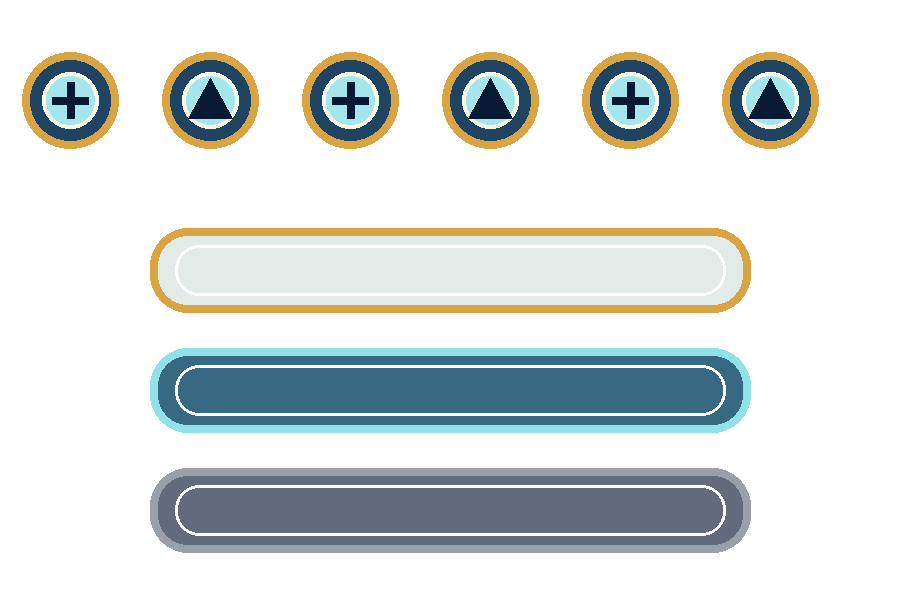

# 示例：月宫列传（早期示例）

> 主完整交付案例已切换为 [云阙列传（国风卡牌 RPG）](../guofeng-card-rpg/README.md)。本目录保留作分阶段操作示例的输入源。

`moon-palace-rpg` 展示早期“原型生成视觉 → UI 风格确认 → UI 延展 → UI 组件拆解 → 雪碧图拆分与 PNG 打包”闭环。

## 项目设定

- 游戏类型：国风神话卡牌 RPG
- 核心玩法：六人编队、回合战斗、角色养成与月相羁绊
- 目标平台：手机竖屏
- 视觉关键词：午夜蓝、鎏金、白玉、云纹、月轮
- 首个基准页面：首页

## 原型视觉


首页承担每日回流和继续主线两个核心目标。中央月轮与原创角色形成主视觉，顶部展示玩家资源，底部使用六项固定导航，两侧只保留少量高优入口。

页面提示词保存在 [`prompts/pages/home.md`](prompts/pages/home.md)，真实尺寸、批准状态和版本来源记录在 [`contracts/asset-manifest.yaml`](contracts/asset-manifest.yaml)。

## UI 风格

[`contracts/style-contract.yaml`](contracts/style-contract.yaml) 将视觉方向转换为后续页面可读取的契约：

- 午夜蓝作为背景，鎏金承担主操作和奖励强调
- 磨砂白玉、拉丝金属和青蓝玻璃组成材质体系
- 全项目使用左上柔光、统一圆角和统一图标视角
- 中文生图不可靠时预留后期排版区域

修改风格时应生成新页面版本，不覆盖已批准资源。

## UI 延展

[`contracts/screen-contract.yaml`](contracts/screen-contract.yaml) 已从首页延展出首发路径：

```text
首页 → 编队 → 关卡选择 → 战斗 → 结算 → 成长 → 返回首页
```

示例详细定义了首页、编队和关卡选择的页面目的、入口、主操作、依赖、状态、边界场景和数据需求。完整生成顺序见 [`plan.md`](plan.md)。

## UI 组件拆解

示例从已批准首页拆出：

- 无控件的月宫背景
- 无文字的透明主按钮


主按钮使用可编辑 SVG，演示图片工具无法稳定输出透明通道时的安全降级：

[`assets/components/primary-button-default-v1.svg`](assets/components/primary-button-default-v1.svg)

每个组件拥有独立提示词、尺寸、透明背景要求、状态和 manifest 条目，便于后期合成和开发交付。

## 雪碧图拆分与 PNG 包

示例还提供一张包含六个图标和三个按钮状态的透明组件雪碧图：



运行：

```bash
python3 scripts/split_sprite_sheet.py \
  examples/moon-palace-rpg/assets/sprites/home-ui-sheet.png \
  --output-dir examples/moon-palace-rpg/assets/sprites/home-ui/items \
  --zip examples/moon-palace-rpg/packages/home-ui-png.zip \
  --prefix home-ui --min-area 100 --padding 8
```

输出：

- 9 个独立透明 PNG
- 每个元素的原图坐标与尺寸
- `sprite-manifest.yaml`
- [可下载 PNG 压缩包](packages/home-ui-png.zip)

项目级数据记录在 [`contracts/sprite-contract.yaml`](contracts/sprite-contract.yaml)，全局 manifest 只登记原始雪碧图和最终 ZIP。

## 目录导览

```text
moon-palace-rpg/
├── spec.md                         # 需求与验收标准
├── research.md                     # 视觉研究与设计决策
├── plan.md                         # 页面路线和生成批次
├── tasks.md                        # 分阶段任务
├── quickstart.md                   # 复现与人工验收
├── contracts/
│   ├── style-contract.yaml         # UI 风格契约
│   ├── screen-contract.yaml        # 页面契约
│   ├── component-contract.yaml     # 组件契约
│   ├── sprite-contract.yaml        # 雪碧图拆分契约
│   └── asset-manifest.yaml         # 全局资源清单
├── prompts/
│   ├── pages/
│   └── components/
└── assets/
    ├── pages/
    ├── components/
    └── sprites/
        ├── home-ui-sheet.png
        └── home-ui/items/
```

最终 PNG 包位于：

```text
packages/home-ui-png.zip
```

## 运行示例校验

在仓库根目录执行：

```bash
python3 scripts/validate_project.py examples/moon-palace-rpg --strict
```

校验覆盖文档完整性、YAML 结构、页面与组件 ID、资源路径、尺寸、透明背景字段和跨文件引用。

## 用自己的项目复现

```bash
python3 scripts/init_project.py your-game-id
```

然后在 Cursor 中调用：

```text
使用 game-ui-workflow，参考 examples/moon-palace-rpg 的交付结构，
为 specs/your-game-id 依次执行原型生成视觉、UI 风格切换、
UI 延展、UI 组件拆解和雪碧图拆分打包。
每一步完成后停止，给出检查项和下一步调用文本。
```

当前示例图片工具返回 1024×1536，而目标契约为 9:16。该差异已如实记录在 manifest 和 `quickstart.md`，正式项目应重新生成或裁切，不能伪造目标尺寸。
